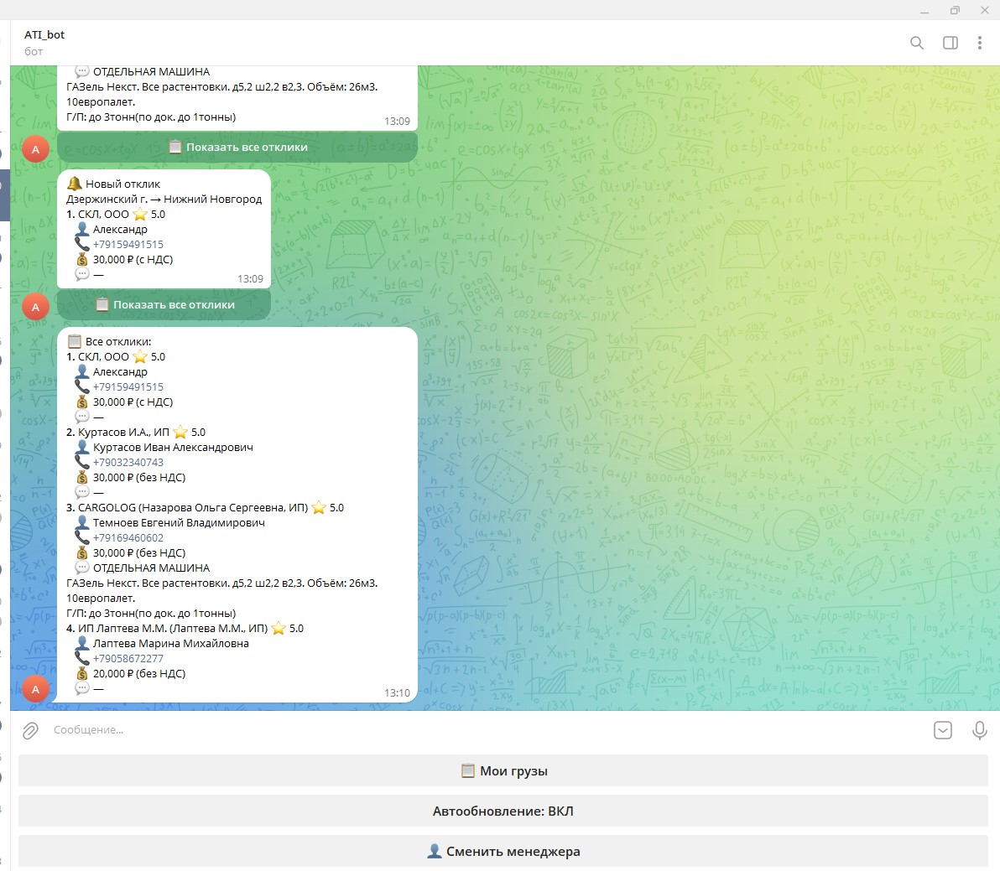
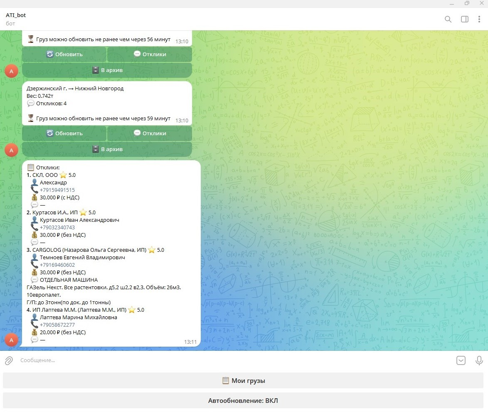
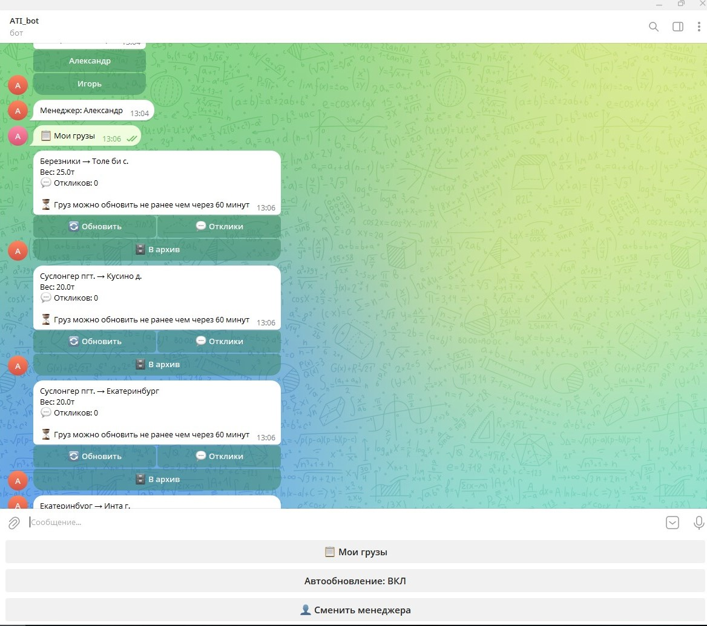

# 🚛 ATI Loads Monitor — Telegram Bot

Система мониторинга грузов и откликов с ATI.SU API с уведомлениями в Telegram.

Проект автоматизирует работу логиста:

* отслеживает новые отклики на грузы
* фильтрует только релевантные (свои)
* уведомляет почти в реальном времени
* управляет грузами (обновление, архив)

---

# 👨‍💻 Моя роль

* Полностью разработал проект с нуля
* Спроектировал архитектуру (API клиент, Telegram-бот, scheduler, state)
* Реализовал интеграцию с ATI.SU API
* Обработал нестабильные ответы API (цены, НДС, структура данных)
* Настроил деплой через Docker на VPS
* Реализовал мульти-аккаунт логику (несколько менеджеров)

---

# 🎯 Бизнес-задача

В ручном режиме экспедитор:

* постоянно проверяет отклики
* переключается между грузами
* рискует пропустить выгодные предложения

👉 Решение:

Система автоматически:

* отслеживает новые отклики
* фильтрует по менеджеру (владельцу груза)
* отправляет уведомления в Telegram

---

# ⚙️ Основной функционал

* 📋 Получение списка своих грузов
* 💬 Просмотр откликов по каждому грузу
* 🔔 Уведомления о новых откликах
* ♻️ Автообновление грузов
* 🗄 Архивация грузов
* 👤 Поддержка нескольких менеджеров

---

# 🧠 Ключевая логика (core feature)

Мониторинг новых откликов:

1. Получение времени последней проверки (`date_from`)
2. Запрос к ATI API:

```
/loads/new/responses
```

3. Получение новых откликов
4. Загрузка своих грузов
5. Фильтрация:

```python
if load_id not in loads_map:
    continue
```

👉 Исключаются отклики на чужие грузы
👉 Уведомления только по релевантным данным

---

# ⚡ Scheduler

Реализован через APScheduler.

### Проверка откликов

* каждые **10 секунд**
* near real-time уведомления (~1–5 сек задержка)

### Обновление грузов

* каждые **60 минут**
* учитывает ограничения ATI API (rate limits)

---

# 🧱 Архитектура

Разделение на слои:

* `ati_client.py` — работа с внешним API
* `telegram_bot.py` — UI и обработчики
* `scheduler.py` — фоновые задачи
* `state.py` — управление состоянием
* `config.py` — конфигурация

Общий поток:

```
Telegram → Bot → Scheduler → ATI API
```

---

# 💡 Engineering Highlights

### Работа с нестабильным API

ATI API возвращает цену в разных полях:

* `NdsPrice`
* `NotNdsPrice`
* `PayAttributes`

Реализована fallback-логика определения цены.

---

### Фильтрация по владельцу груза

Используется `contact_id`:

* исключает чужие грузы
* решает проблему “уведомления приходят всем”

---

### Near real-time обработка

* polling каждые 10 секунд
* минимальная задержка уведомлений

---

### Управление состоянием

* хранение состояния по менеджерам
* контроль автообновления
* отслеживание времени последней проверки

---

# 📊 Характеристики

* Проверка откликов: каждые 10 секунд
* Задержка уведомлений: ~1–5 секунд
* Поддержка нескольких менеджеров
* Асинхронная обработка (httpx + aiogram)

---

# 🧩 Сложности

* ATI API возвращает данные в нестабильной структуре
* Цена может приходить в разных полях (с/без НДС)
* Нет прямой привязки отклика к владельцу груза
* Пришлось реализовать фильтрацию через `contact_id`
* Необходим контроль частоты запросов (rate limit API)

---

# ⚠️ Ограничения

* состояние хранится в памяти (теряется при рестарте)
* возможны дубли уведомлений после перезапуска
* отсутствует база данных
* используется polling вместо webhooks

---

# 🛠 Стек

* Python 3.10+
* aiogram 3
* httpx (async)
* APScheduler
* Docker

---

# 🚀 Деплой

* Развернут на VPS (Linux)
* Используется Docker + docker-compose
* Настроен автоперезапуск контейнера
* Бот работает 24/7

---

# 📈 Возможные улучшения

* переход на БД (PostgreSQL)
* дедупликация через ResponseId
* переход на webhooks
* добавление аналитики откликов
* веб-интерфейс

---

# 💬 Результат

Реализован рабочий инструмент, который:

* снижает ручной труд логиста
* ускоряет обработку откликов
* уменьшает вероятность потери выгодных предложений

Проект приближен к production-решению и учитывает реальные ограничения внешнего API.

## ⚙️ Настройка

Скопируйте шаблон, и заполните своими значениями:

```bash
cp .env.example .env
```

## 📸 Screenshots

### 🔔 Новый отклик


### 💬 Список откликов


### 📋 Мои грузы

