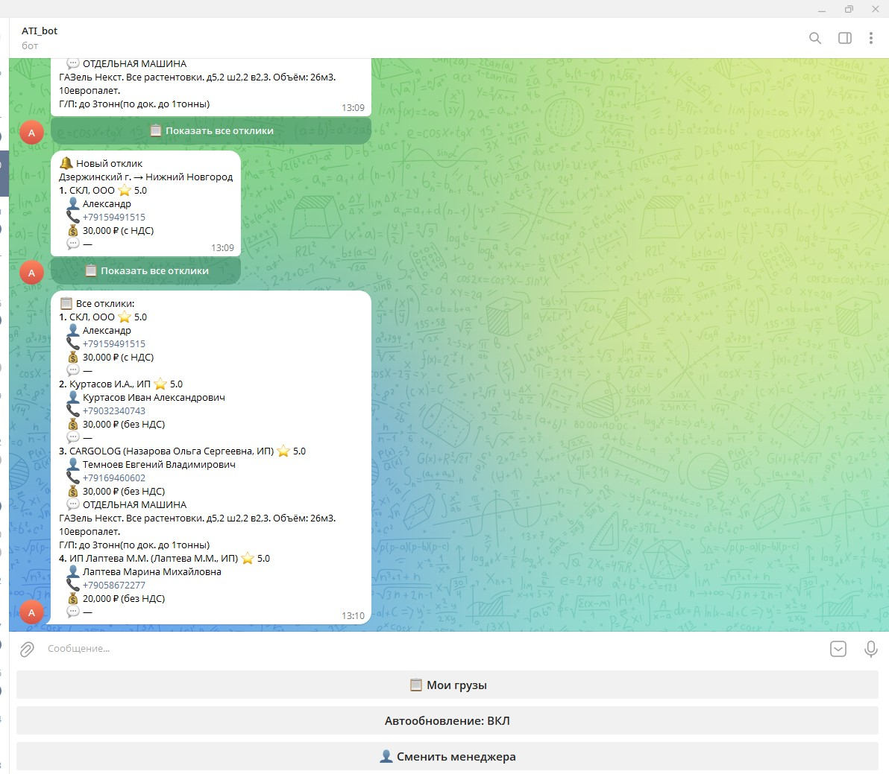
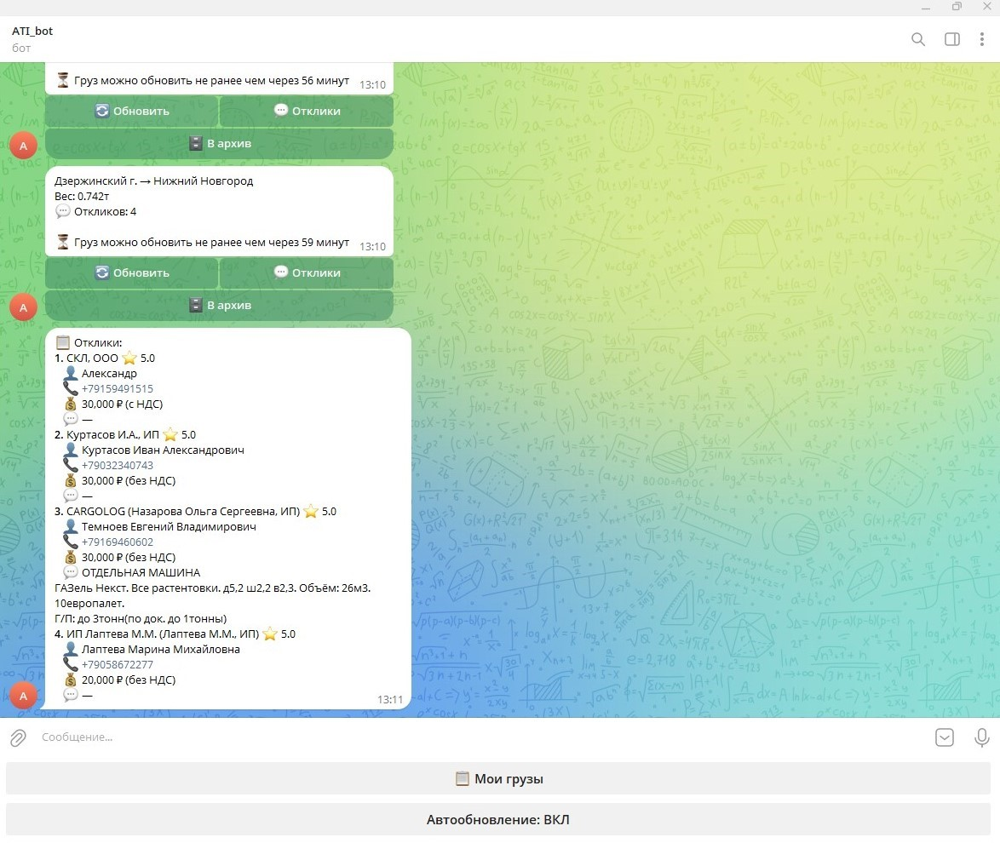
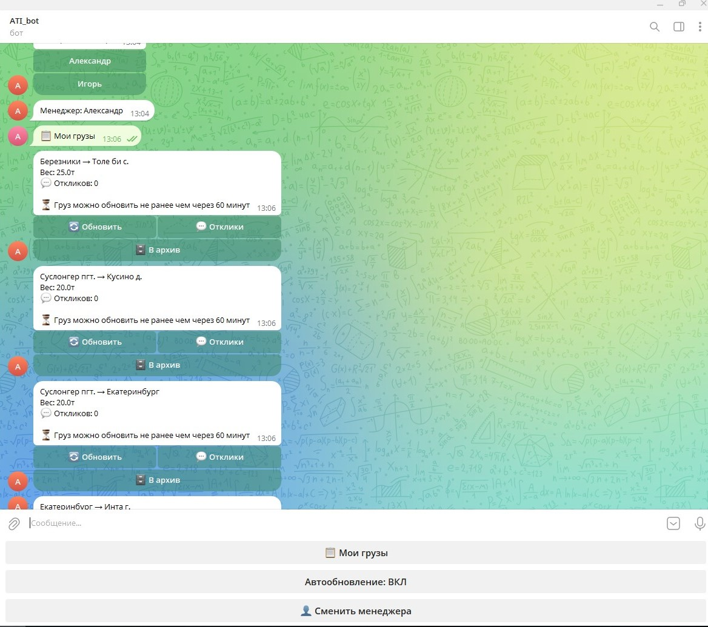

# ATI Loads Monitor — Telegram Bot

Инструмент автоматизации работы логиста: мониторинг грузов и откликов через ATI.SU API с уведомлениями в Telegram.

---

## О проекте

Разработан с нуля для внутреннего использования транспортной компанией. Заменяет ручную проверку откликов на грузы, сокращает время реакции на новые предложения.

**Что делает бот:**

- уведомляет о новых откликах в режиме близком к реальному времени
- автоматически обновляет грузы по расписанию
- фильтрует данные по владельцу груза — каждый менеджер видит только свои
- позволяет управлять грузами прямо из Telegram (просмотр откликов, обновление, архивация)

---

## Стек

| Компонент | Технология |
|---|---|
| Язык | Python 3.10+ |
| Telegram | aiogram 3 |
| HTTP-клиент | httpx (async) |
| Планировщик | APScheduler |
| Деплой | Docker, docker-compose |

---

## Архитектура

```
Telegram → telegram_bot.py → ati_client.py → ATI.SU API
               ↑
          scheduler.py (фоновые задачи)
               ↑
            state.py (runtime state)
```

| Модуль | Ответственность |
|---|---|
| `ati_client.py` | Интеграция с ATI.SU API, парсинг ответов |
| `telegram_bot.py` | Обработчики команд, форматирование сообщений |
| `scheduler.py` | Фоновые задачи: проверка откликов и обновление грузов |
| `state.py` | Состояние в памяти (тайминги, флаги автообновления) |
| `config.py` | Конфигурация через переменные окружения |

---

## Ключевые технические решения

**Фильтрация по владельцу груза**

ATI API не позволяет запросить только свои грузы напрямую. Реализована фильтрация по `contact_id` на стороне приложения — каждый менеджер получает уведомления только по своим грузам.

**Нестабильная структура ответа API**

Цена груза может приходить в трёх разных полях (`NdsPrice`, `NotNdsPrice`, `PayAttributes`). Реализована fallback-логика с приоритетами и определением признака НДС через битовую маску.

**Авторизация**

Доступ ограничен по Telegram `user_id`. Каждому пользователю в конфиге назначен менеджер — исключает доступ к чужим данным без лишней инфраструктуры.

**Мониторинг откликов**

Планировщик каждые 5 минут запрашивает `/loads/new/responses?dateFrom=...` и сопоставляет результат с актуальным списком грузов менеджера. Отклики на чужие грузы отфильтровываются.

---

## Расписание задач

| Задача | Интервал | Описание |
|---|---|---|
| Проверка откликов | 5 минут | Запрос новых откликов, уведомление в Telegram |
| Обновление грузов | 60 минут | Автопродление грузов с учётом rate limit API |

---

## Ограничения

- Состояние хранится в памяти (сбрасывается при рестарте)
- Polling вместо webhooks

---

## Деплой

```bash
cp .env.example .env
# заполнить токены и chat_id в .env
docker compose up -d
```

Переменные окружения: `TELEGRAM_BOT_TOKEN`, `ATI_*_ACCESS_TOKEN`, `ATI_*_CONTACT_ID`, `TELEGRAM_CHAT_ID_*`.

---

## Скриншоты

### Новый отклик


### Список откликов


### Мои грузы

